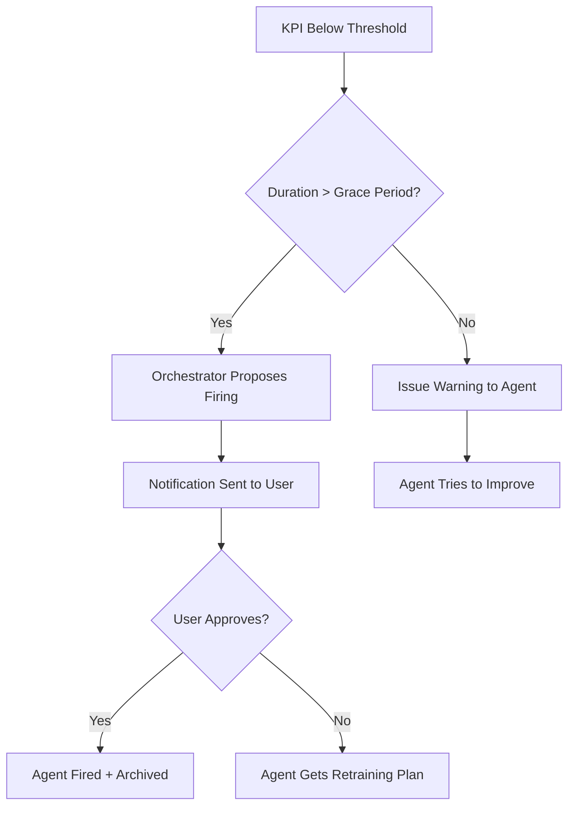
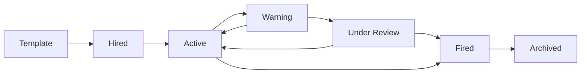
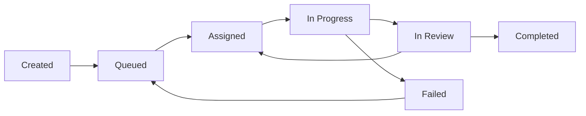
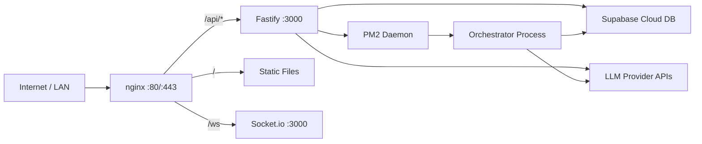

# CompanyRun — Architecture Plan

> **"Run your own AI company."**
> A multi-agent orchestration system where an AI CEO manages AI employees — hiring, firing, assigning tasks, tracking KPIs, and managing a virtual economy — all through a web dashboard.

---

## 1. Vision

CompanyRun is an open-source backend + frontend system that simulates a real company, but every employee is an AI agent. A persistent **Orchestrator** (the "CEO") runs 24/7, managing a pool of AI workers. Each worker has a specific role, can learn new skills (via MCP tool connections), earns virtual currency for completing tasks, and can be fired for poor performance.

The system is **general purpose** — anyone can download it, configure their LLM providers, and spin up an AI company that handles any domain of work.

---

## 2. Core Concepts

| Company Metaphor | Technical Reality |
|---|---|
| CEO / Orchestrator | Always-on daemon process that manages agents, routes tasks, monitors KPIs |
| Employee | An AI agent instance with a role, skills, wallet, and performance history |
| Hiring | Spawning a new agent from a template, provisioning MCP tools, allocating budget |
| Firing | Graceful shutdown after performance review + user approval |
| Skill | An MCP server connection giving the agent a new capability |
| Salary / Wage | Virtual credits earned per task completion, scaled by role and performance |
| KPI | Quantified performance metrics: task completion rate, quality, speed |
| Task | A unit of work created by user or orchestrator, assigned to an agent |
| Department | Logical grouping of agents by domain |

---

## 3. System Architecture

```mermaid
graph TB
    subgraph Frontend
        WEB[Web Dashboard - React + Vite]
    end

    subgraph Backend
        API[API Server - Fastify]
        WS[WebSocket - Socket.io]
        ORCH[Orchestrator - Always On]
        AM[Agent Manager]
        LLM[LLM Gateway]
        MCP_MGR[MCP Manager]
        ECON[Economy Engine]
        KPI_SYS[KPI System]
        TASK[Task System]
    end

    subgraph External
        OR[OpenRouter]
        TAI[TogetherAI]
        AC[AskCodi]
        NR[9router]
        SB[Supabase PostgreSQL]
        MCP_SRV[MCP Servers - Tools]
    end

    subgraph Agents
        A1[Agent: Developer]
        A2[Agent: Writer]
        A3[Agent: Analyst]
        AN[Agent: ...]
    end

    WEB -->|REST + WS| API
    WEB --> WS
    API --> ORCH
    API --> AM
    API --> ECON
    API --> KPI_SYS
    API --> TASK

    ORCH --> AM
    ORCH --> TASK
    ORCH --> ECON
    ORCH --> KPI_SYS

    AM --> A1
    AM --> A2
    AM --> A3
    AM --> AN

    A1 --> LLM
    A2 --> LLM
    A3 --> LLM
    AN --> LLM

    A1 --> MCP_MGR
    A2 --> MCP_MGR
    AN --> MCP_MGR

    LLM --> OR
    LLM --> TAI
    LLM --> AC
    LLM --> NR

    MCP_MGR --> MCP_SRV

    AM --> SB
    ECON --> SB
    KPI_SYS --> SB
    TASK --> SB
    ORCH --> SB
end
```

---

## 4. Tech Stack

### 4.1 Backend

| Layer | Technology | Rationale |
|---|---|---|
| Runtime | Node.js 20+ / TypeScript | PM2 already on machine; lightweight for RPi ARM64 |
| API Framework | Fastify | Faster than Express, low overhead, schema validation |
| ORM | Drizzle ORM | Lightweight, type-safe, excellent PostgreSQL support |
| WebSocket | Socket.io | Real-time dashboard updates, agent status streaming |
| MCP SDK | @modelcontextprotocol/sdk | Official MCP client for tool connections |
| Process Manager | PM2 | Already installed; manages orchestrator daemon |
| Validation | Zod | Schema validation for API inputs and configs |

### 4.2 Frontend

| Layer | Technology | Rationale |
|---|---|---|
| Framework | React 18 + Vite | Fast build, lightweight SPA suitable for RPi serving |
| Styling | Tailwind CSS | Utility-first, small bundle, rapid UI development |
| State | Zustand | Minimal, no boilerplate, performant |
| Real-time | Socket.io-client | Matches backend WebSocket |
| Charts | Recharts | KPI dashboards, economy graphs |
| Routing | React Router v6 | SPA navigation |
| Icons | Lucide React | Lightweight icon set |

### 4.3 Database

| Component | Technology |
|---|---|
| Provider | Supabase (cloud-hosted) |
| Engine | PostgreSQL 15+ |
| Migrations | Drizzle Kit |
| Realtime | Supabase Realtime (optional, for live subscriptions) |

### 4.4 LLM Providers

| Provider | Use Case |
|---|---|
| OpenRouter | Primary — access to GPT-4o, Claude, Llama, etc. |
| TogetherAI | Fast inference for lightweight tasks; open-source models |
| AskCodi | Code-generation specialized tasks |
| 9router | Alternative routing / fallback |

> **Strategy**: Orchestrator uses the most capable model. Employees use cost-effective models matched to their role. The LLM Gateway handles routing, fallback, and cost tracking.

---

## 5. Core Modules

### 5.1 LLM Gateway — `src/llm/`

Unified interface over all LLM providers. Every agent and the orchestrator call LLMs through this gateway.

**Responsibilities:**
- Provider-agnostic `chat()` and `complete()` methods
- Model routing: map agent roles to optimal models
- Automatic retry with fallback providers
- Token counting and cost calculation per request
- Rate limiting per provider
- Request/response logging

**Key Interface:**
```
ILLMProvider
  ├── chat(messages, options) → response
  ├── models() → available models list
  └── cost(usage) → cost in USD
```

### 5.2 Orchestrator — `src/orchestrator/`

The "CEO". A persistent daemon that runs on a heartbeat loop.

**Responsibilities:**
- Monitor task queue and assign work to agents
- Evaluate agent performance on schedule
- Propose hiring when workload exceeds capacity
- Propose firing when agent KPI drops below threshold (requires user approval)
- Manage company budget and wage distribution
- Handle user commands from dashboard
- Generate daily/weekly company reports

**Decision Flow for Firing:**


### 5.3 Agent Manager — `src/agents/`

Handles the full lifecycle of AI employees.

**Agent Lifecycle:**


**Agent Properties:**
- `id`, `name`, `role`, `status`
- `systemPrompt` — personality + instructions
- `skills[]` — connected MCP servers
- `wallet` — current credit balance
- `kpiScore` — current performance rating
- `memory` — conversation context window
- `assignedTasks[]` — current work
- `provider` + `model` — which LLM to use

**Agent Templates** (predefined roles):
- Developer — code generation, debugging, code review
- Writer — content creation, editing, translation
- Analyst — data analysis, research, reporting
- Designer — UI/UX suggestions, mockups
- Support — customer response, FAQ handling
- Custom — user-defined role

### 5.4 Economy Engine — `src/economy/`

Virtual currency system that creates natural incentives.

**Currency: Credits (CR)**

| Event | Credits |
|---|---|
| Task completed successfully | +10 to +100 CR (based on complexity) |
| KPI above target | +20 CR bonus |
| Skill learned | +15 CR |
| Task failed | -5 CR penalty |
| API call cost | Tracked as expense |
| Idle time | -1 CR/hour (encourages productivity) |

**Wallet Operations:**
- `credit(agentId, amount, reason)` — add credits
- `debit(agentId, amount, reason)` — remove credits
- `transfer(fromId, toId, amount)` — inter-agent transfer
- `getBalance(agentId)` — current balance
- `getStatement(agentId, period)` — transaction history

**Wage System:**
- Each role has a base wage per task
- Performance multiplier: `wage = base × (kpiScore / 100)`
- Orchestrator manages total company budget
- If budget runs low, orchestrator must optimize (cheaper models, fewer agents)

### 5.5 KPI System — `src/kpi/`

Quantified performance tracking for every agent.

**Metrics:**

| Metric | Weight | Measurement |
|---|---|---|
| Task Completion Rate | 30% | Completed / Assigned |
| Quality Score | 25% | User feedback rating (1-5) |
| Response Time | 15% | Average time to complete tasks |
| Tool Efficiency | 15% | Successful tool calls / Total attempts |
| Learning Rate | 10% | New skills acquired per period |
| Cost Efficiency | 5% | Output value / API cost |

**Score Calculation:**
- Each metric normalized to 0-100
- Weighted average = overall KPI score
- Threshold: Below 40 for 3 consecutive reviews = firing candidate

**Review Cycle:**
- Metrics calculated continuously
- Formal review every 24 hours (configurable)
- Warning issued at score < 50
- Firing proposed at score < 40 for 3+ reviews

### 5.6 MCP Manager — `src/mcp/`

Manages MCP server connections as "skills" that agents can learn.

**Skill Catalog (Registry):**
Each MCP server in the registry represents a learnable skill:
- File system operations
- Web browsing / scraping
- Database queries
- API integrations (Slack, Discord, GitHub, etc.)
- Code execution (sandboxed)
- Search (Tavily, etc.)
- Custom user-defined MCP servers

**Learning a Skill:**
1. Orchestrator or user assigns a skill to an agent
2. MCP Manager connects the agent to the MCP server
3. Agent's tool list is updated
4. Agent receives instructions on how to use the new tools
5. Skill recorded in database, agent earns credits

**Dynamic Connection Management:**
- Lazy connection: MCP servers connected only when agent needs them
- Connection pooling for frequently used servers
- Health monitoring: reconnect on failure
- Resource cleanup on agent deactivation

### 5.7 Task System — `src/tasks/`

Work management from creation to completion.

**Task Lifecycle:**


**Task Properties:**
- `id`, `title`, `description`
- `priority` — urgent / high / normal / low
- `complexity` — 1-5 scale (affects credit reward)
- `requiredSkills[]` — MCP skills needed
- `assignedAgentId`
- `status`, `result`
- `createdBy` — user or orchestrator
- `deadline` (optional)

**Task Decomposition:**
- Large tasks auto-decomposed into subtasks by orchestrator
- Subtasks can be assigned to different agents
- Parent task completes when all subtasks complete

---

## 6. Database Schema

### 6.1 Core Tables

```sql
-- Company configuration
CREATE TABLE company (
    id UUID PRIMARY KEY DEFAULT gen_random_uuid(),
    name TEXT NOT NULL DEFAULT 'My AI Company',
    description TEXT,
    budget_total DECIMAL(12,2) DEFAULT 10000.00,
    budget_remaining DECIMAL(12,2) DEFAULT 10000.00,
    config JSONB DEFAULT '{}',
    created_at TIMESTAMPTZ DEFAULT NOW(),
    updated_at TIMESTAMPTZ DEFAULT NOW()
);

-- Agent templates (predefined roles)
CREATE TABLE agent_templates (
    id UUID PRIMARY KEY DEFAULT gen_random_uuid(),
    name TEXT NOT NULL,
    role TEXT NOT NULL,
    description TEXT,
    system_prompt TEXT NOT NULL,
    default_model TEXT,
    default_provider TEXT,
    base_wage DECIMAL(8,2) DEFAULT 10.00,
    default_skills TEXT[] DEFAULT '{}',
    config JSONB DEFAULT '{}',
    created_at TIMESTAMPTZ DEFAULT NOW()
);

-- AI Employees
CREATE TABLE agents (
    id UUID PRIMARY KEY DEFAULT gen_random_uuid(),
    template_id UUID REFERENCES agent_templates(id),
    name TEXT NOT NULL,
    role TEXT NOT NULL,
    status TEXT NOT NULL DEFAULT 'active'
        CHECK (status IN ('active','warning','review','suspended','fired','archived')),
    system_prompt TEXT NOT NULL,
    model TEXT NOT NULL,
    provider TEXT NOT NULL,
    personality JSONB DEFAULT '{}',
    memory JSONB DEFAULT '{}',
    config JSONB DEFAULT '{}',
    hired_at TIMESTAMPTZ DEFAULT NOW(),
    fired_at TIMESTAMPTZ,
    fire_reason TEXT,
    updated_at TIMESTAMPTZ DEFAULT NOW()
);

-- Skills catalog (MCP servers)
CREATE TABLE skills (
    id UUID PRIMARY KEY DEFAULT gen_random_uuid(),
    name TEXT NOT NULL UNIQUE,
    description TEXT,
    mcp_server_command TEXT NOT NULL,
    mcp_server_args TEXT[] DEFAULT '{}',
    mcp_server_env JSONB DEFAULT '{}',
    category TEXT,
    difficulty INTEGER DEFAULT 1 CHECK (difficulty BETWEEN 1 AND 5),
    is_active BOOLEAN DEFAULT TRUE,
    created_at TIMESTAMPTZ DEFAULT NOW()
);

-- Agent-Skill junction
CREATE TABLE agent_skills (
    agent_id UUID REFERENCES agents(id) ON DELETE CASCADE,
    skill_id UUID REFERENCES skills(id) ON DELETE CASCADE,
    learned_at TIMESTAMPTZ DEFAULT NOW(),
    proficiency INTEGER DEFAULT 50 CHECK (proficiency BETWEEN 0 AND 100),
    PRIMARY KEY (agent_id, skill_id)
);

-- Tasks
CREATE TABLE tasks (
    id UUID PRIMARY KEY DEFAULT gen_random_uuid(),
    parent_task_id UUID REFERENCES tasks(id),
    title TEXT NOT NULL,
    description TEXT,
    priority TEXT DEFAULT 'normal'
        CHECK (priority IN ('urgent','high','normal','low')),
    complexity INTEGER DEFAULT 1 CHECK (complexity BETWEEN 1 AND 5),
    status TEXT DEFAULT 'created'
        CHECK (status IN ('created','queued','assigned','in_progress','in_review','completed','failed','cancelled')),
    required_skills TEXT[] DEFAULT '{}',
    assigned_agent_id UUID REFERENCES agents(id),
    created_by TEXT DEFAULT 'user',
    result JSONB,
    credit_reward DECIMAL(8,2),
    deadline TIMESTAMPTZ,
    started_at TIMESTAMPTZ,
    completed_at TIMESTAMPTZ,
    created_at TIMESTAMPTZ DEFAULT NOW(),
    updated_at TIMESTAMPTZ DEFAULT NOW()
);

-- Conversations
CREATE TABLE conversations (
    id UUID PRIMARY KEY DEFAULT gen_random_uuid(),
    agent_id UUID REFERENCES agents(id),
    task_id UUID REFERENCES tasks(id),
    type TEXT DEFAULT 'chat'
        CHECK (type IN ('chat','task','review','system')),
    created_at TIMESTAMPTZ DEFAULT NOW(),
    updated_at TIMESTAMPTZ DEFAULT NOW()
);

-- Messages
CREATE TABLE messages (
    id UUID PRIMARY KEY DEFAULT gen_random_uuid(),
    conversation_id UUID REFERENCES conversations(id) ON DELETE CASCADE,
    role TEXT NOT NULL CHECK (role IN ('user','assistant','system','tool')),
    content TEXT NOT NULL,
    tool_calls JSONB,
    token_count INTEGER,
    cost DECIMAL(8,6),
    created_at TIMESTAMPTZ DEFAULT NOW()
);
```

### 6.2 Economy Tables

```sql
-- Wallets
CREATE TABLE wallets (
    id UUID PRIMARY KEY DEFAULT gen_random_uuid(),
    agent_id UUID UNIQUE REFERENCES agents(id) ON DELETE CASCADE,
    balance DECIMAL(12,2) DEFAULT 0.00,
    total_earned DECIMAL(12,2) DEFAULT 0.00,
    total_spent DECIMAL(12,2) DEFAULT 0.00,
    updated_at TIMESTAMPTZ DEFAULT NOW()
);

-- Transactions
CREATE TABLE transactions (
    id UUID PRIMARY KEY DEFAULT gen_random_uuid(),
    wallet_id UUID REFERENCES wallets(id) ON DELETE CASCADE,
    type TEXT NOT NULL CHECK (type IN ('earning','penalty','bonus','wage','expense','transfer')),
    amount DECIMAL(8,2) NOT NULL,
    balance_after DECIMAL(12,2) NOT NULL,
    description TEXT,
    reference_type TEXT,
    reference_id UUID,
    created_at TIMESTAMPTZ DEFAULT NOW()
);
```

### 6.3 Performance Tables

```sql
-- KPI Metrics (raw data points)
CREATE TABLE kpi_metrics (
    id UUID PRIMARY KEY DEFAULT gen_random_uuid(),
    agent_id UUID REFERENCES agents(id) ON DELETE CASCADE,
    metric_name TEXT NOT NULL,
    metric_value DECIMAL(8,4) NOT NULL,
    period_start TIMESTAMPTZ NOT NULL,
    period_end TIMESTAMPTZ NOT NULL,
    created_at TIMESTAMPTZ DEFAULT NOW()
);

-- Performance Reviews
CREATE TABLE performance_reviews (
    id UUID PRIMARY KEY DEFAULT gen_random_uuid(),
    agent_id UUID REFERENCES agents(id) ON DELETE CASCADE,
    overall_score DECIMAL(5,2) NOT NULL,
    metrics JSONB NOT NULL,
    recommendation TEXT CHECK (recommendation IN ('promote','maintain','warn','review','fire')),
    notes TEXT,
    reviewed_at TIMESTAMPTZ DEFAULT NOW()
);

-- Activity Log (audit trail)
CREATE TABLE activity_log (
    id UUID PRIMARY KEY DEFAULT gen_random_uuid(),
    actor TEXT NOT NULL,
    action TEXT NOT NULL,
    entity_type TEXT,
    entity_id UUID,
    details JSONB DEFAULT '{}',
    created_at TIMESTAMPTZ DEFAULT NOW()
);
```

### 6.4 System Tables

```sql
-- LLM Provider configurations
CREATE TABLE llm_providers (
    id UUID PRIMARY KEY DEFAULT gen_random_uuid(),
    name TEXT NOT NULL UNIQUE,
    base_url TEXT NOT NULL,
    api_key_env TEXT NOT NULL,
    models JSONB DEFAULT '[]',
    is_active BOOLEAN DEFAULT TRUE,
    config JSONB DEFAULT '{}',
    created_at TIMESTAMPTZ DEFAULT NOW()
);

-- LLM Usage tracking
CREATE TABLE llm_usage (
    id UUID PRIMARY KEY DEFAULT gen_random_uuid(),
    provider TEXT NOT NULL,
    model TEXT NOT NULL,
    agent_id UUID REFERENCES agents(id),
    prompt_tokens INTEGER NOT NULL,
    completion_tokens INTEGER NOT NULL,
    cost_usd DECIMAL(8,6),
    latency_ms INTEGER,
    created_at TIMESTAMPTZ DEFAULT NOW()
);

-- Orchestrator state
CREATE TABLE orchestrator_state (
    id UUID PRIMARY KEY DEFAULT gen_random_uuid(),
    status TEXT DEFAULT 'running',
    last_heartbeat TIMESTAMPTZ DEFAULT NOW(),
    pending_decisions JSONB DEFAULT '[]',
    config JSONB DEFAULT '{}',
    updated_at TIMESTAMPTZ DEFAULT NOW()
);
```

---

## 7. API Design

### 7.1 Company

| Method | Endpoint | Description |
|---|---|---|
| GET | `/api/company` | Company overview + stats |
| PUT | `/api/company/config` | Update company settings |
| GET | `/api/company/report` | Daily/weekly report |

### 7.2 Agents

| Method | Endpoint | Description |
|---|---|---|
| GET | `/api/agents` | List all employees |
| GET | `/api/agents/:id` | Agent detail |
| POST | `/api/agents/hire` | Hire from template |
| POST | `/api/agents/:id/fire` | Fire (requires user confirmation) |
| PUT | `/api/agents/:id` | Update agent config |
| POST | `/api/agents/:id/skills` | Assign new skill |
| DELETE | `/api/agents/:id/skills/:skillId` | Remove skill |
| GET | `/api/agents/:id/kpi` | Agent KPI history |
| GET | `/api/agents/:id/wallet` | Agent wallet + transactions |

### 7.3 Tasks

| Method | Endpoint | Description |
|---|---|---|
| GET | `/api/tasks` | List tasks (filterable) |
| POST | `/api/tasks` | Create task |
| GET | `/api/tasks/:id` | Task detail |
| PUT | `/api/tasks/:id` | Update task |
| POST | `/api/tasks/:id/assign` | Assign to agent |
| POST | `/api/tasks/:id/review` | Submit review/feedback |

### 7.4 Economy

| Method | Endpoint | Description |
|---|---|---|
| GET | `/api/economy/overview` | Financial summary |
| GET | `/api/economy/transactions` | Transaction history |
| GET | `/api/economy/leaderboard` | Top earners |
| POST | `/api/economy/budget` | Adjust company budget |

### 7.5 Orchestrator

| Method | Endpoint | Description |
|---|---|---|
| GET | `/api/orchestrator/status` | Current status + heartbeat |
| POST | `/api/orchestrator/command` | Send command to orchestrator |
| GET | `/api/orchestrator/decisions` | Pending decisions needing approval |
| POST | `/api/orchestrator/decisions/:id/approve` | Approve a decision |
| POST | `/api/orchestrator/decisions/:id/reject` | Reject a decision |

### 7.6 Skills

| Method | Endpoint | Description |
|---|---|---|
| GET | `/api/skills` | Skill catalog |
| POST | `/api/skills` | Register new MCP skill |
| GET | `/api/skills/:id` | Skill detail |
| PUT | `/api/skills/:id` | Update skill config |

### 7.7 Chat

| Method | Endpoint | Description |
|---|---|---|
| POST | `/api/chat` | Send message to orchestrator or agent |
| GET | `/api/chat/conversations` | List conversations |
| GET | `/api/chat/conversations/:id` | Conversation messages |

### 7.8 WebSocket Events

| Event | Direction | Description |
|---|---|---|
| `agent:status` | Server → Client | Agent status change |
| `task:update` | Server → Client | Task progress update |
| `orchestrator:decision` | Server → Client | New decision needs approval |
| `economy:transaction` | Server → Client | New transaction |
| `chat:message` | Bidirectional | Real-time chat messages |
| `system:heartbeat` | Server → Client | System health pulse |

---

## 8. Frontend Pages

### 8.1 Dashboard (Home)
- Company stats: total agents, active tasks, budget remaining
- Activity feed (recent events)
- Pending orchestrator decisions (approve/reject)
- Quick actions: hire agent, create task

### 8.2 Agents Page
- Grid/list of all agents with status badges
- Click to expand: skills, KPI chart, wallet balance, current tasks
- Hire button → template selector dialog
- Fire button → confirmation with reason

### 8.3 Task Board
- Kanban-style board: Queued → Assigned → In Progress → Review → Done
- Create task form
- Task detail panel with progress and results

### 8.4 Economy Dashboard
- Total company budget vs spent
- Per-agent earnings chart
- Transaction log
- Leaderboard
- Cost breakdown by LLM provider

### 8.5 Chat
- Chat with orchestrator (give commands, ask questions)
- Chat with individual agents
- Conversation history

### 8.6 Settings
- Company configuration
- LLM provider API keys
- MCP skill registry management
- KPI thresholds
- Economy parameters (wages, rewards, penalties)

---

## 9. Directory Structure

```
CompanyRun/
├── README.md
├── PLAN.md
├── package.json
├── tsconfig.json
├── drizzle.config.ts
├── .env.example
├── ecosystem.config.js          # PM2 config
│
├── src/
│   ├── index.ts                 # Entry point
│   │
│   ├── config/
│   │   ├── env.ts               # Environment variables
│   │   ├── providers.ts         # LLM provider defaults
│   │   └── database.ts          # Supabase/Drizzle connection
│   │
│   ├── server/
│   │   ├── app.ts               # Fastify app setup
│   │   ├── websocket.ts         # Socket.io setup
│   │   └── routes/
│   │       ├── agents.ts
│   │       ├── tasks.ts
│   │       ├── economy.ts
│   │       ├── orchestrator.ts
│   │       ├── chat.ts
│   │       ├── skills.ts
│   │       └── company.ts
│   │
│   ├── orchestrator/
│   │   ├── index.ts             # Main loop (heartbeat daemon)
│   │   ├── scheduler.ts         # Task scheduling + assignment
│   │   ├── decision-engine.ts   # Hire/fire/rebalance logic
│   │   └── consultation.ts      # User approval flow
│   │
│   ├── agents/
│   │   ├── manager.ts           # Agent CRUD + lifecycle
│   │   ├── runtime.ts           # Agent execution loop
│   │   ├── templates.ts         # Role template definitions
│   │   └── memory.ts            # Context/memory management
│   │
│   ├── llm/
│   │   ├── gateway.ts           # Unified LLM interface
│   │   ├── tracker.ts           # Token/cost tracking
│   │   └── providers/
│   │       ├── base.ts          # ILLMProvider interface
│   │       ├── openrouter.ts
│   │       ├── togetherai.ts
│   │       ├── askcodi.ts
│   │       └── 9router.ts
│   │
│   ├── mcp/
│   │   ├── manager.ts           # MCP lifecycle management
│   │   ├── registry.ts          # Skill catalog
│   │   └── connector.ts         # Dynamic MCP connections
│   │
│   ├── economy/
│   │   ├── engine.ts            # Credit system logic
│   │   ├── wallet.ts            # Wallet operations
│   │   ├── wages.ts             # Wage calculations
│   │   └── reports.ts           # Financial reporting
│   │
│   ├── kpi/
│   │   ├── calculator.ts        # Score calculations
│   │   ├── reviewer.ts          # Performance review runner
│   │   └── metrics.ts           # Metric definitions
│   │
│   ├── tasks/
│   │   ├── manager.ts           # Task CRUD
│   │   ├── queue.ts             # Priority queue
│   │   ├── decomposer.ts        # Break into subtasks
│   │   └── reviewer.ts          # Quality review
│   │
│   ├── db/
│   │   ├── schema.ts            # Drizzle schema (all tables)
│   │   ├── migrations/          # Generated migrations
│   │   └── seed.ts              # Seed data (templates, skills)
│   │
│   └── shared/
│       ├── types.ts             # Shared TypeScript types
│       ├── errors.ts            # Custom error classes
│       ├── logger.ts            # Logging utility
│       └── utils.ts             # Helper functions
│
├── frontend/
│   ├── package.json
│   ├── vite.config.ts
│   ├── tailwind.config.js
│   ├── index.html
│   └── src/
│       ├── App.tsx
│       ├── main.tsx
│       ├── pages/
│       │   ├── Dashboard.tsx
│       │   ├── Agents.tsx
│       │   ├── Tasks.tsx
│       │   ├── Economy.tsx
│       │   ├── Chat.tsx
│       │   └── Settings.tsx
│       ├── components/
│       │   ├── layout/
│       │   │   ├── Sidebar.tsx
│       │   │   ├── Header.tsx
│       │   │   └── Layout.tsx
│       │   ├── agents/
│       │   │   ├── AgentCard.tsx
│       │   │   ├── AgentGrid.tsx
│       │   │   ├── HireDialog.tsx
│       │   │   └── AgentDetail.tsx
│       │   ├── tasks/
│       │   │   ├── TaskBoard.tsx
│       │   │   ├── TaskCard.tsx
│       │   │   └── CreateTaskForm.tsx
│       │   ├── economy/
│       │   │   ├── BudgetOverview.tsx
│       │   │   ├── TransactionLog.tsx
│       │   │   └── Leaderboard.tsx
│       │   ├── chat/
│       │   │   ├── ChatWindow.tsx
│       │   │   ├── MessageBubble.tsx
│       │   │   └── ConversationList.tsx
│       │   └── common/
│       │       ├── StatusBadge.tsx
│       │       ├── KPIChart.tsx
│       │       └── DecisionCard.tsx
│       ├── stores/
│       │   ├── agentStore.ts
│       │   ├── taskStore.ts
│       │   ├── economyStore.ts
│       │   └── chatStore.ts
│       ├── services/
│       │   ├── api.ts           # REST client
│       │   └── socket.ts        # WebSocket client
│       └── types/
│           └── index.ts
│
└── docs/
    ├── ARCHITECTURE.md
    ├── API.md
    ├── DEPLOYMENT.md
    └── CONTRIBUTING.md
```

---

## 10. Implementation Phases

### Phase 1 — Foundation
- Project scaffolding (monorepo setup, TypeScript, ESLint)
- Supabase project creation + database schema migration
- Environment config + `.env.example`
- Drizzle ORM setup + connection test
- Basic Fastify server with health check endpoint
- PM2 ecosystem config

### Phase 2 — LLM Gateway
- Provider interface (`ILLMProvider`)
- OpenRouter provider implementation
- TogetherAI provider implementation
- AskCodi provider implementation
- 9router provider implementation
- Gateway with model routing + fallback logic
- Token/cost tracker

### Phase 3 — Agent System
- Agent manager (CRUD + lifecycle state machine)
- Agent templates (Developer, Writer, Analyst, etc.)
- Agent runtime (execution loop with LLM + tools)
- Agent memory/context management
- Agent API routes

### Phase 4 — MCP Integration
- MCP manager + connector
- Skill registry (catalog of available MCP servers)
- Dynamic MCP connection per agent
- Skill learning flow (assign skill → connect → verify)
- Skill API routes

### Phase 5 — Orchestrator
- Main daemon loop with heartbeat
- Task scheduling algorithm
- Agent assignment logic (match skills to task requirements)
- Decision engine (hire/fire proposals)
- User consultation flow (pending decisions queue)
- Orchestrator API routes

### Phase 6 — Task System
- Task CRUD + state machine
- Priority queue
- Task decomposition (large task → subtasks)
- Quality review flow
- Task API routes

### Phase 7 — Economy Engine
- Wallet system (create on hire, archive on fire)
- Credit/debit operations
- Wage calculation (role base × performance multiplier)
- Transaction logging
- Budget management
- Economy API routes

### Phase 8 — KPI System
- Metric collectors (hook into task completion, tool usage, etc.)
- Score calculator (weighted average)
- Performance review runner (scheduled)
- Warning + firing recommendation pipeline
- KPI API routes

### Phase 9 — WebSocket + Real-time
- Socket.io server setup
- Event emitters in all modules
- Client subscription management
- Real-time dashboard updates

### Phase 10 — Frontend
- Vite + React + Tailwind scaffolding
- Layout (sidebar, header, routing)
- Dashboard page
- Agents page (grid, detail, hire/fire dialogs)
- Task board (Kanban)
- Economy dashboard (charts, leaderboard)
- Chat interface
- Settings page

### Phase 11 — Deployment + Polish
- nginx reverse proxy config (API + frontend)
- PM2 production config
- Seed data (default templates, sample skills)
- Error handling + logging
- Documentation (README, API docs, deployment guide)
- Docker support (optional)

---

## 11. Deployment Architecture (RPi)



- **nginx** serves the built frontend as static files and reverse-proxies `/api/*` and `/ws` to the Fastify backend
- **PM2** manages the backend process + orchestrator (can be same process or separate)
- **Supabase** runs in the cloud — no database overhead on RPi
- **LLM APIs** are all cloud-hosted — no local inference needed

---

## 12. Environment Variables

```env
# Server
PORT=3000
NODE_ENV=production

# Supabase
SUPABASE_URL=https://your-project.supabase.co
SUPABASE_ANON_KEY=your-anon-key
DATABASE_URL=postgresql://...

# LLM Providers
OPENROUTER_API_KEY=sk-or-...
TOGETHERAI_API_KEY=...
ASKCODI_API_KEY=...
NINE_ROUTER_API_KEY=...

# Economy
INITIAL_COMPANY_BUDGET=10000
DEFAULT_TASK_REWARD=10
IDLE_PENALTY_PER_HOUR=1

# KPI
KPI_REVIEW_INTERVAL_HOURS=24
KPI_WARNING_THRESHOLD=50
KPI_FIRE_THRESHOLD=40
KPI_FIRE_CONSECUTIVE_REVIEWS=3

# Orchestrator
ORCHESTRATOR_HEARTBEAT_MS=30000
ORCHESTRATOR_MODEL=openai/gpt-4o
ORCHESTRATOR_PROVIDER=openrouter
```

---

## 13. Key Design Decisions

| Decision | Choice | Rationale |
|---|---|---|
| Monorepo vs Separate repos | Monorepo | Simpler for single-machine deployment on RPi |
| REST vs GraphQL | REST + WebSocket | Simpler, lower overhead, sufficient for this use case |
| Drizzle vs Prisma | Drizzle | Lighter weight, better for ARM64, type-safe |
| Fastify vs Express | Fastify | 2-3x faster, schema validation built-in |
| Zustand vs Redux | Zustand | Minimal boilerplate, sufficient for dashboard |
| Single process vs Microservices | Single process | RPi has limited resources; one process with internal modules |
| Cloud Supabase vs Self-hosted | Cloud | RPi cannot efficiently run PostgreSQL + Supabase stack |
| MCP per agent vs Shared pool | Per agent (lazy) | Isolation between agents; lazy connections save resources |

---

## 14. Security Considerations

- API keys stored in environment variables, never in database
- Supabase Row Level Security enabled for multi-tenant future
- MCP tool execution sandboxed per agent
- Rate limiting on all API endpoints
- WebSocket authentication via token
- Input validation via Zod schemas on all endpoints
- CORS configured for frontend origin only

---

## 15. Future Extensions

- **Multi-user / Multi-company**: Multiple users each running their own company
- **Agent-to-Agent collaboration**: Agents can delegate subtasks to each other
- **Skill marketplace**: Community-contributed MCP skill packs
- **Voice interface**: Talk to your CEO via speech-to-text
- **Mobile app**: React Native companion
- **Agent training**: Fine-tuning or RAG-based specialization
- **Webhooks**: External system integration (Slack, Discord notifications)
